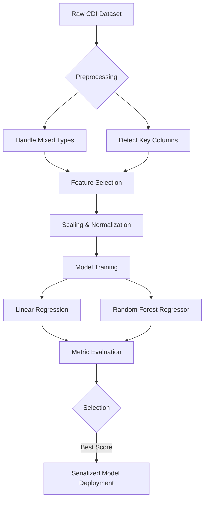
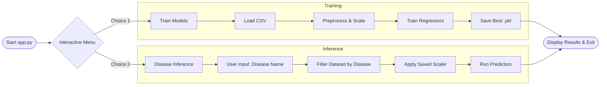

# 🏥 Chronic Disease Progression Predictor

[](https://opensource.org/licenses/MIT)
[](https://www.python.org/downloads/)
[](https://GitHub.com/SanyogSingh07/Chronic-Disease-Progression-Predictor/graphs/commit-activity)
[](https://GitHub.com/SanyogSingh07/Chronic-Disease-Progression-Predictor/pulls)
[](https://github.com/SanyogSingh07/Chronic-Disease-Progression-Predictor/stargazers)

A professional Machine Learning pipeline for predicting the progression rate of chronic diseases using the **U.S. Chronic Disease Indicators (CDI)** dataset. This tool provides a high-performance command-line interface (CLI) to train models and perform inference on specific disease types with real-time feedback.

---

## 📊 Project Workflow

The following diagram illustrates the end-to-end data processing and machine learning pipeline:



---

## 🛠️ System Architecture & Flow

This flowchart describes the interactive logic of the CLI application:



---

## 🚀 Key Features

- **Professional Terminal UI**: Uses `rich` for elegant panels, animated status indicators, and color-coded results.
- **Intelligent Preprocessing**: Automatic identification of patient IDs, temporal features, and target variables.
- **Comparative Modeling**: Benchmarks multiple regression algorithms (Random Forest, Linear Regression) to ensure maximum accuracy.
- **Scalable Inference**: Modular design allows for easy integration of new models or additional healthcare indicators.
- **Resource Optimized**: Efficient data handling using `pandas` and `scikit-learn` with memory-safe loading.

## 🔬 Technical Details

### Data Preprocessing
- **Mixed Type Handling**: Configured to process large-scale CSVs without dtype warnings.
- **Normalization**: Utilizes `MinMaxScaler` for uniform feature representation.
- **Sequence Engineering**: (Optional) Framework support for temporal sequence generation for longitudinal studies.

### Algorithms
- **Random Forest Regressor**: Handles non-linear relationships and feature importance.
- **Linear Regression**: Baseline model for variance analysis.
- **Serialization**: Models and scalers are persisted using `joblib` for zero-latency inference.

## 📁 Repository Tags
`machine-learning` `python` `healthcare-ai` `chronic-disease` `data-science` `scikit-learn` `predictive-analytics` `cli-dashboard`

---

## ⚙️ Installation & Usage

### Setup
```bash
git clone https://github.com/SanyogSingh07/Chronic-Disease-Progression-Predictor.git
cd Chronic-Disease-Progression-Predictor
python -m venv .venv
# Activate venv:
# Windows: .venv\Scripts\activate | Unix: source .venv/bin/activate
pip install -r requirements.txt
```

### Running the App
```bash
python app.py
```

## 📄 License
Distributed under the **MIT License**. See `LICENSE` for more information.

## 👤 Author
**Sanyog Singh**
- [GitHub Profile](https://github.com/SanyogSingh07)
- [Project Repository](https://github.com/SanyogSingh07/Chronic-Disease-Progression-Predictor)
