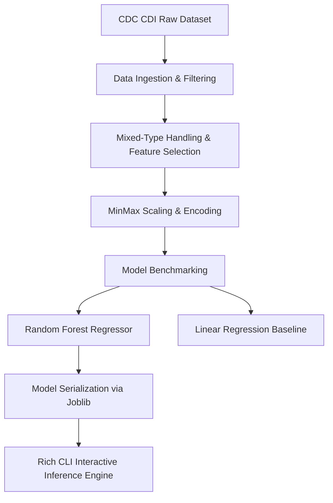

# Chronic Disease Progression Predictor

> Machine Learning pipeline for predicting chronic disease progression using U.S. Chronic Disease Indicators (CDI) data.

[Repository](https://github.com/SanyogSingh07/Chronic-Disease-Progression-Predictor)

---

## Overview

The **Chronic Disease Progression Predictor** is a modular Machine Learning pipeline and interactive terminal interface designed to model and forecast chronic disease progression rates from U.S. CDC Chronic Disease Indicators (CDI) data.

---

## Problem Statement

Chronic diseases account for significant long-term healthcare demands. Forecasting disease progression rates across distinct demographic and geographical indicators enables public health planners and analysts to evaluate risk trends and prioritize resource allocations.

---

## Architecture & Workflow


```mermaid
graph TD
    A[CDC CDI Raw Dataset] --> B[Data Ingestion & Filtering]
    B --> C[Mixed-Type Handling & Feature Selection]
    C --> D[MinMax Scaling & Encoding]
    D --> E[Model Benchmarking]
    E --> F[Random Forest Regressor]
    E --> G[Linear Regression Baseline]
    F --> H[Model Serialization via Joblib]
    H --> I[Rich CLI Interactive Inference Engine]
```

### Technical Features
- **Data Preprocessing**: Efficient handling of multi-column CDC datasets, missing value imputation, and feature scaling using `scikit-learn`.
- **Comparative Modeling**: Trains and evaluates multiple regression models (Random Forest, Linear Regression) to select optimal predictive performance.
- **Rich Terminal Interface**: Full interactive CLI dashboard built with `rich` featuring progress meters, status panels, and colored terminal displays.

---

## Tech Stack

- **Language**: Python 3.8+
- **Machine Learning**: Scikit-learn, Joblib
- **Data Processing**: Pandas, NumPy
- **UI / CLI**: Rich

---

## Project Structure

```text
Chronic-Disease-Progression-Predictor/
├── app.py                  # CLI application entry point
├── data/                   # Dataset directory
├── src/
│   ├── config.py           # Configuration parameters
│   ├── cli.py              # Rich CLI interface handler
│   ├── data/               # Data loaders & preprocessors
│   ├── models/             # Model training & persistence logic
│   └── utils/              # Logging & helpers
├── requirements.txt        # Dependencies
└── README.md
```

---

## Setup & Execution

```bash
git clone https://github.com/SanyogSingh07/Chronic-Disease-Progression-Predictor.git
cd Chronic-Disease-Progression-Predictor
python -m venv .venv
# Activate venv: Windows: .venv\Scripts\activate | Unix: source .venv/bin/activate
pip install -r requirements.txt
python app.py
```

---

## License

Distributed under the **MIT License**.
